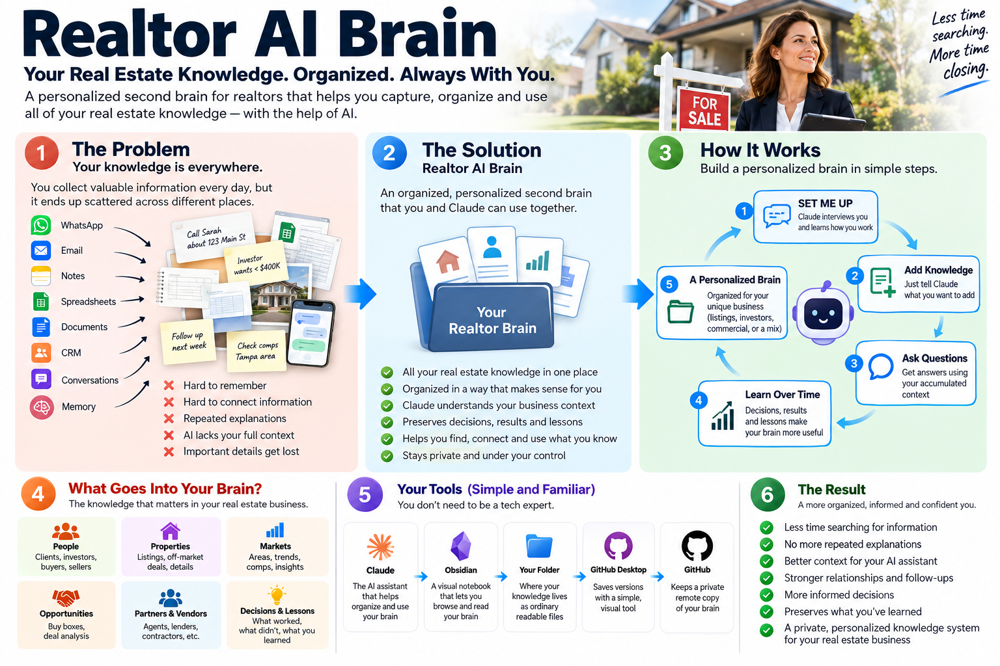
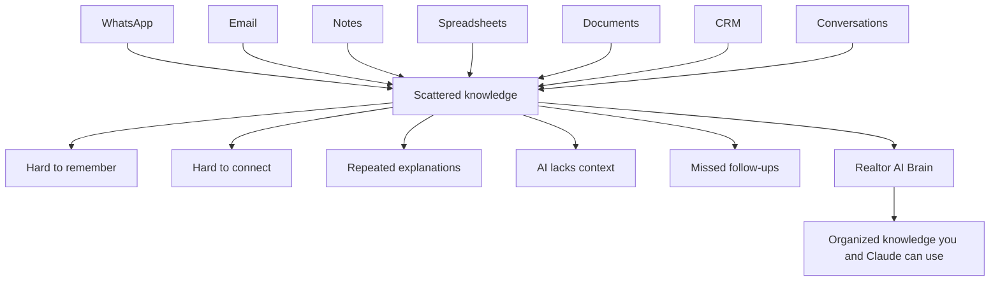
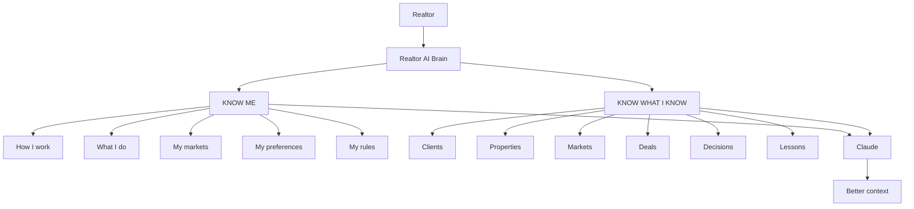
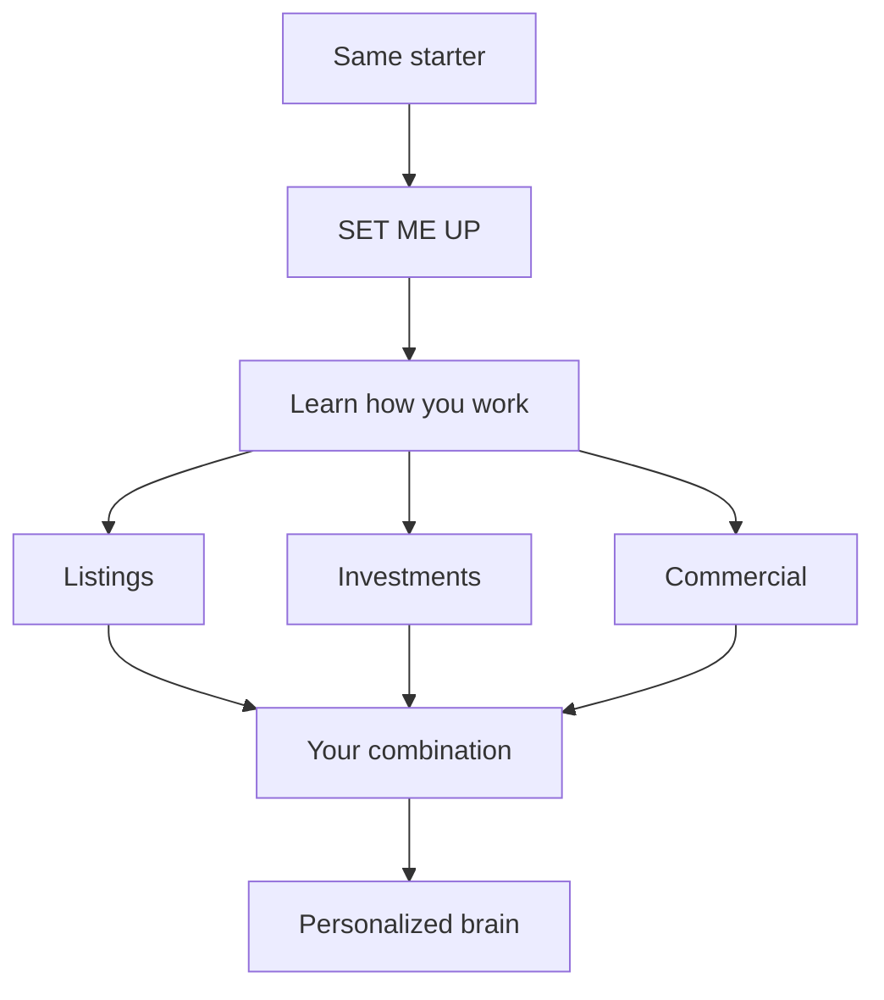
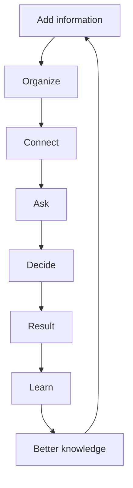
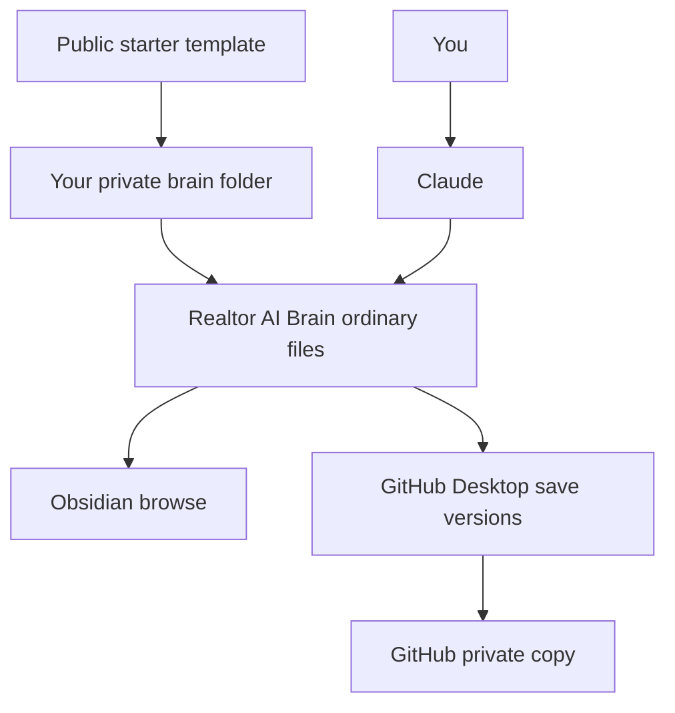

# Realtor AI Brain

Realtor AI Brain is a beginner-friendly starter for building a personal AI-supported Second Brain (an organized place to keep and use your business knowledge) for your real-estate business.

## Realtor AI Brain at a glance

*Your scattered real-estate knowledge becomes one organized, personalized brain that you and Claude can use together.*

This starter helps you create a private folder where that business knowledge can live in ordinary readable files, so **you** can review it and **Claude** can help organize it, update it, connect it, and use it in future conversations.

## The problem this solves

If you work in real estate, you probably know a lot more than any one app, note, or spreadsheet shows.

Your useful knowledge gets spread across:

- clients, leads, buyers, sellers, and investors
- properties, listings, comparable sales, and market notes
- lenders, contractors, vendors, and partners
- follow-ups, conversations, decisions, results, and lessons learned
- WhatsApp, texts, email, notes, spreadsheets, CRM systems, documents, browser tabs, and memory

The deeper problem is usually **not** just "I can't find a file."

It is:

> I know a lot about my business, but that knowledge is scattered, and my AI does not automatically understand all of that context every time I start a new conversation.

That leads to repeated explanations:

- who a client is
- what an investor wants
- what happened with a property
- which numbers were estimates
- what was decided
- what changed
- what worked, failed, or was learned

Important context can disappear between conversations. Realtor AI Brain is meant to give that context a home.

This shows the main idea: scattered business knowledge becomes more useful when it is organized in one place that both you and Claude can work from.

## What is a Second Brain?

A **Second Brain** is an organized place outside your head where you keep important knowledge so you can find it and use it later.

A traditional Second Brain helps **you** remember.

An **AI-supported** Second Brain goes further:

- **you** can read the knowledge
- **the AI** can read the knowledge
- **the AI** can help organize, connect, and reason over the knowledge

In Realtor AI Brain:

- **the folder** holds the actual knowledge as ordinary readable files
- **Claude** helps organize and use that knowledge
- **Obsidian** lets you browse and read it like a library of notes
- **GitHub Desktop** helps you save versions
- **GitHub** can hold a private online copy

## Public template vs. your private brain

This GitHub project is the **PUBLIC template**. It is an empty starter.

Your real Realtor AI Brain should be a **PRIVATE personal copy** that you create before adding actual business information.

That means:

- the public template should not contain your clients, deals, notes, or business knowledge
- your personal brain should live in a **private GitHub project** before you start adding real information
- you should not weaken your own privacy standards just because the notes are useful

> ⚠️ **Important privacy checkpoint:** before entering real business or client information, make sure you are working in your own **private** copy, not in a public GitHub project. See **[docs/PRIVACY.md](docs/PRIVACY.md)**.

## KNOW ME

**KNOW ME** means the brain learns how **you** work:

- what kind of real-estate work you do
- which markets you serve
- whether you focus on listings, investors, commercial, or a mix
- what matters when you evaluate an opportunity
- how you prefer information organized
- how you communicate
- what rules and preferences matter in your business

In plain English: **KNOW ME = understand the person and the business.**

## KNOW WHAT I KNOW

**KNOW WHAT I KNOW** means the brain accumulates useful business knowledge over time:

- people and relationships
- investors, buyers, and sellers
- properties and listings
- markets and opportunities
- buy boxes and preferences
- vendors and partners
- decisions, results, and lessons learned

In plain English: **KNOW WHAT I KNOW = organize and preserve business knowledge.**

These are connected, but they are not the same:

- **KNOW ME** is about how you work
- **KNOW WHAT I KNOW** is about what your business has learned and collected

The goal is simple: Claude should understand both **how you work** and **what your business knows** well enough to give more useful help.

## What happens when I say "SET ME UP"?

`SET ME UP` is the onboarding conversation. Claude first learns how you work, then recommends a brain shape that fits your business.

Here is a **short fictional example** of the tone:

**USER:** SET ME UP

**CLAUDE:** Let's learn how you work before I build anything. What parts of real estate are you involved in? (Residential buyers / Listings / Investment properties / Commercial / Property management / Other)

**USER:** I work mostly with investors and listings. About 60% investors and 40% listings. I mainly work in Tampa, Wesley Chapel and Zephyrhills.

**CLAUDE:** Got it. For your investor work, what usually makes a property interesting?

**USER:** Most of my investors want properties below $400,000. I normally look at comparable sales, rehab, ARV (after-repair value), rent, cap rate and cash-on-cash return.

**CLAUDE:** And for your listing work, what matters most?

**USER:** Pricing, comps, seller follow-up, preparing the property, marketing, showings and offers.

This is not about forcing you into a rigid template. It is about learning how **you** actually work.

## Example: a personalized brain Claude might recommend

**Example only — your result should reflect your own business, not this exact list.**

**Your Realtor Brain**

- People & Relationships
- Properties
- Markets
- Investment
  - Investor Buy Boxes
  - Opportunities
  - Deal Analysis
- Listings
  - Sellers
  - Active Listings
  - Pricing & Comps
  - Marketing
- Partners & Vendors
- Decisions & Lessons

After that, Claude should ask something like:

> Does this match how you work?

You can approve it or ask for changes in normal language.

The starter does not assume every realtor works the same way. It starts from the same foundation, then shapes the brain around your real mix of work.

## "Add this to my brain"

Once your brain exists, you can add information in natural language.

**USER:** Add this to my brain: Sarah is an investor looking for properties in Tampa under $400,000. She prefers light rehab and wants at least a 10% cash-on-cash return.

Conceptually, Claude can organize that as:

- Sarah
- Investor
- Tampa
- Under $400,000
- Light rehab
- 10%+ cash-on-cash target

You do **not** need to decide which file should hold that information. Claude should place it in the right part of the brain.

## Add a property to the same story

**USER:** Add this to my brain: 123 Main Street is listed for $315,000. It has 3 bedrooms, 2 bathrooms and about 1,650 square feet. The seller says the roof was replaced in 2021. A contractor gave me a rough rehab estimate of $35,000. I think the ARV may be around $430,000, but I haven't verified the comps yet.

That matters because not all information is equally certain.

- **KNOWN / REPORTED:** asking price $315,000; 3 bedrooms; 2 bathrooms; about 1,650 square feet; seller reports the roof was replaced in 2021
- **ESTIMATE:** rough rehab estimate of $35,000
- **UNVERIFIED ASSUMPTION:** possible ARV around $430,000; comparable sales have not been verified yet

Seller-reported information should not be treated as independently verified fact just because it was written down. The brain becomes more useful when it preserves what is known, reported, estimated, assumed, or still uncertain.

## Now I can ask my brain questions

After information has been stored, you can ask natural questions such as:

- Would Sarah potentially be interested in 123 Main Street?
- What information am I missing before deciding whether this is a good deal?
- What properties currently match Sarah's buy criteria?
- What do I know about 123 Main Street?
- Which numbers are confirmed, reported, estimated or still uncertain?
- What investors might fit this property?
- What follow-ups do I still have?
- What have I learned from similar deals?
- What do I know about this market?
- Which assumptions still need verification?

## Illustrative example response

**Illustrative example — actual answers depend on the information stored in your brain.**

> Sarah could potentially be a fit.
>
> **WHY IT MAY FIT** — The $315,000 asking price is below her $400,000 maximum. The property is in Tampa. There is a rough $35,000 rehab estimate.
>
> **WHAT WE DON'T KNOW YET** — Whether $35,000 qualifies as "light rehab" for Sarah. Verified comparable sales. Verified ARV. Expected rent. Taxes and insurance. Financing assumptions. Final rehab scope.
>
> **CONCLUSION** — There is enough information to investigate the property further, but not enough yet to conclude that it is a good investment for Sarah.

## When information changes

Suppose the old information says:

- **BEFORE:** Sarah wants properties below $400,000

Then later you add:

> Sarah told me today she can now go to $450K, but she doesn't want more than $30K in rehab.

One useful way for the brain to handle that update is to keep:

- **AFTER:** current max price $450,000
- **AFTER:** current rehab preference is $30,000 or less
- **HISTORY:** Sarah previously preferred properties below $400,000

The important idea is to keep the current preference clear, avoid creating a duplicate Sarah, and, when useful, retain earlier context instead of acting as if the newest information had always been the only information.

## When information conflicts

Suppose the existing information says:

- 123 Main Street asking price = $315,000

Then a new note says:

> The listing agent told me it's actually $325K. Zillow still shows $315K.

Because the operating contract says Claude should preserve source provenance and surface uncertainty, it should not silently pick whichever number it likes.

A useful V1 result is something like:

- **Listing-agent information:** $325,000
- **Other or older source:** $315,000
- **Status:** conflicting information; current asking price needs verification

That is part of the value. The brain is not only storing notes. It is preserving context about what is known, uncertain, changed, or conflicting.

## Your brain can become more useful as you learn

One useful way the brain can become more valuable over time is by preserving the difference between a decision, a later result, and the lesson that came from it.

- **DECISION:** We initially thought the rehab might cost about $35K.
- **RESULT:** Later contractor bids were closer to $55K. Sarah passed on the deal.
- **LESSON:** The early rehab assumption was too optimistic.
- **FUTURE USE:** When evaluating similar properties later, you can see what happened instead of only seeing the original estimate.

This is the kind of learning loop the brain is meant to support: keep what was known at the time, then add the later result and lesson afterward.

This loop is where the brain becomes more valuable over time: not just from storing information, but from preserving what happened and what you learned from it.

## Why Claude, Obsidian, GitHub Desktop, and GitHub are involved

Once the value is clear, the tool roles are simple:

- **Claude** — the AI assistant that helps understand, organize, and use the brain
- **Obsidian** — the visual notebook that lets you browse and read the brain
- **The folder** — where the actual knowledge lives as ordinary readable files
- **GitHub Desktop** — the visual tool for saving versions and sending them to GitHub without needing terminal commands in the normal beginner path
- **GitHub** — where you can keep a private online copy of your personal brain

The public starter helps you begin. Your real working brain should be your own private copy, filled with your own knowledge.

## What this does not do

Realtor AI Brain does **not**:

- automatically know everything about you
- replace MLS
- replace a CRM
- independently verify every property fact
- guarantee good investment decisions
- replace professional judgment
- continuously learn information it was never given

The quality of the brain depends on the information you give it. Claude can help organize, connect, and reason over that information, but important facts and business decisions still require human review.

## Important before you start

This beginner path uses the Claude desktop app's **Code** tab to work with a folder on your computer. That currently requires a paid Claude plan:

- **Pro**
- **Max**
- **Team**
- **Enterprise**

Official Claude desktop quickstart: https://code.claude.com/docs/en/desktop-quickstart

## Time to expect

- **Part A — Get Ready:** about **20–30 minutes**
- **Part B — Build and Use Your Brain:** about **45–60 minutes**

These are estimates. If this is your first time using these tools, budget extra time.

## Important disclaimer

**Disclaimer:** Realtor AI Brain is provided as a sample, informational, and productivity tool. It does not provide legal, financial, investment, tax, appraisal, brokerage, or other professional advice. AI-generated responses may be inaccurate, incomplete, or outdated, and no specific business, investment, or real-estate outcome is guaranteed. Users are responsible for independently verifying important information, exercising their own professional judgment, and making their own business and real-estate decisions. Users are also responsible for protecting confidential information and complying with applicable laws, brokerage policies, contracts, and third-party service terms.

## Ready to build your Realtor AI Brain?

Before you start: This beginner setup uses the Claude desktop app's **Code** tab, which currently requires a Claude **Pro, Max, Team, or Enterprise** subscription. The guide walks you through the rest of the setup step by step.

The beginner tutorial will guide you through:

1. Get the tools ready
2. Connect the Realtor Brain folder
3. Say **SET ME UP**
4. Answer a short interview
5. Approve the personalized structure
6. Add the first knowledge
7. Ask the first question
8. Browse it in Obsidian
9. Save the brain

Start here: **[docs/START-HERE.md](docs/START-HERE.md)**

Tutorial path: **README → START HERE → GET READY → BUILD YOUR BRAIN → ADD KNOWLEDGE → ASK YOUR BRAIN → OBSIDIAN → SAVE & BACK UP**
